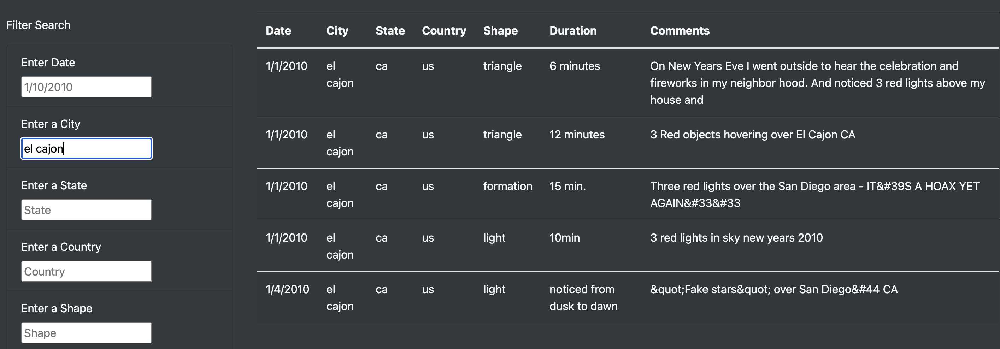

# UFO Sightings

## Project Overview

### Purpose

The purpose of this project was to use `HTML`, `CSS`, and `Javascript` to display UFO sightings data from `data.js` to a webpage. The data is to be in a table format with filter options.

## Results

### Top of Page Layout

The top of page was designed to be a pleasant intro to the webpage and to set the tone for UFOs and give a nighttime feeling.

### Default Table

The default table is meant to show the entirety of the data:

### Date-Filtered Table

Here is an example of the table being filtered by date:

### City-Filtered Table

Here is an example of the table being filtered by city:

## Summary

### Drawbacks of this Webpage

- There is nothing to warn against incorrect formatting of user entered filters

### Recommendations for Future Development

- Users would have an easier time if the filters allowed case insensitivity
- Users would have an easier time if the date filter used some intuitive date selection tool
- The `Duration` column entries should be of the same data type, which could allow for a `less than` or `greater than` type of filtering.
